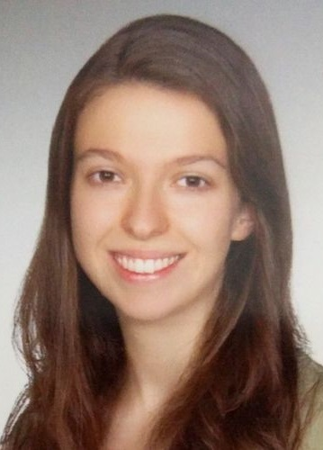

# İlkay Yıldız, PhD 

   

[**Google Scholar**](https://scholar.google.com/citations?user=rXGU5mYAAAAJ&hl=en) 

[**Linkedin**](https://www.linkedin.com/in/ilkay-y%C4%B1ld%C4%B1z/)  

<a href="Yildiz_CV_after_PhD.pdf">**CV**</a>

Ilkay Yildiz received her PhD in 2017 from the Electrical and Computer Engineering Department of Northeastern University, Boston, MA. She received her B.Sc. (2017) from the Electrical and Electronics Engineering Department of Bilkent University, Turkey. Her PhD project is on learning from comparison labels for accurate and fast detection of the Retinopathy of Prematurity disease, one of the leading causes of childhood blindness. Her research interests span ranking and preference learning, deep learning, optimization, probabilistic modeling, and computer vision. In her spare time, she enjoys playing the violin and swimming.

## Publications

[Deep Spectral Ranking](http://proceedings.mlr.press/v130/yildiz21a/yildiz21a.pdf)

*İ. Yıldız, J. Dy, D. Erdoğmuş, S. Ostmo, J. P. Campbell, M. F. Chiang, and S. Ioannidis. AISTATS, 2021.* [\[talk\]](https://www.youtube.com/watch?v=GZKGAlvvUGw)

- V. M. Yildiz, S. Ioannidis, I. Yildiz, P. Tian, J. P. Campbell, S. Ostmo, J. Kalpathy-Cramer, M. F. Chiang, D.Erdogmus, J. Dy, “Structural Visual Guidance Attention Networks in Retinopathy of Prematurity”, ISBI, Virtual Conference, 2021
- A. Hanif, I. Yildiz, P. Tian, B. Kalkanli, D. Erdogmus, S. Ioannidis, J. Dy, J. Kalpathy-Cramer, S. Ostmo, K. Jonas, R. P. Chan, M. F. Chiang, J. P. Campbell, “Improved training efficiency for deep learning models using disease severity comparison labels”, ARVO Abstract, 2021
- I. Yildiz, J. Dy, D. Erdogmus, J. Kalpathy-Cramer, S. Ostmo, J. P. Campbell, M. F. Chiang, S. Ioannidis, “Fast and Accurate Ranking Regression”, AISTATS, Virtual Conference, 2020
- T. Weiss, I. Yildiz, N. Agarwal, E. Ataer-Cansizoglu, J.-W., Choi, “Image-Driven Furniture Style for Interactive 3D Scene Modeling”, Pacific Graphics, 2020
- I. Yildiz, E. Cansizoglu, H. Liu, P.B. Golbus, O. Tezcan, J.W. Choi, “Deep Ranking for Style-Aware Room Recommendations”, AAAI, Student Abstract, 2020
- M. Han, S. Y. Günay, I. Yildiz, P. Bonato, C. D. Onal, T. Padir, G. Schirner, D. Erdogmus, “From hand-perspective visual information to grasp type probabilities: deep learning via ranking labels”, PETRA, 2020
- I. Yildiz, P. Tian, J. Dy, D. Erdogmus, J. Brown, J. Kalpathy-Cramer, S. Ostmo, J. P. Campbell, M. F. Chiang, S. Ioannidis, “Classification and Comparison via Neural Networks”, Elsevier J. of Neural Networks, Vol. 118, 10/2019, pp. 65-80
- V. M. Yildiz, P. Tian, I. Yildiz, J. M. Brown, J. Kalpathy-Cramer, J. Dy, S. Ioannidis, D. Erdogmus, S. Ostmo, S. J. Kim, R. P. Chan, “Plus Disease in Retinopathy of Prematurity: Convolutional Neural Network Performance Using a Combined Neural Network and Feature Extraction Approach”, Translational Vision Science & Technology, 9(2), 10-10.
- B. Kadioglu, I. Yildiz, P. Closas, M.B. Fried-Oken, D. Erdogmus, “Robust Fusion of c-VEP and Gaze”, Journal of Selected Topics in Signal Processing, 2018
- B. Kadioglu, I. Yildiz, P. Closas, D. Erdogmus, “M-estimation based Subspace Learning for Brain Computer Interfaces”, Journal of Selected Topics in Signal Processing, 2018
- M.L. Valero, I. Yildiz, E. Mabande, E.A.P. Habets, “Coherence-aware stereophonic residual echo estimation”, HSCMA, 2017
- H. C. Baykara, E. Biyik, G. Gul, D. Onural, A. S. Ozturk, I. Yildiz, “Real-Time Detection, Tracking and Classification of Multiple Moving Objects in UAV Videos”, ICTAI, 2017

